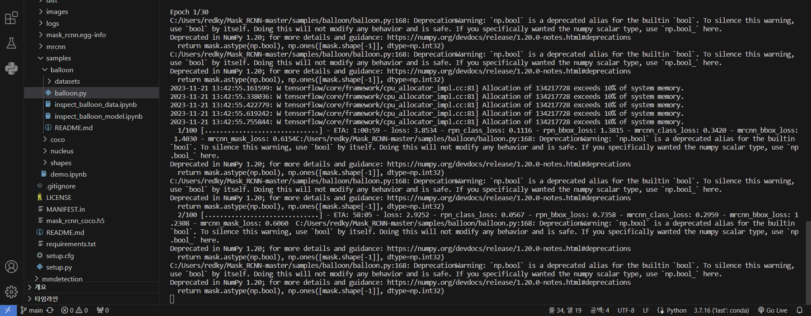

# Mask R-CNN 적용 과제 1번 오픈소스 201911977_이세훈(matterport님 꺼)😿
https://github.com/matterport/Mask_RCNN

requirements.txt에 보시면 아래와 같이 mask R-CNN 실행을 위해 모듈버전을 수정해서 작성했습니다.

opencv-python==4.1.2.30
scikit-image==0.16.2
tensorboard==1.15.0 
tensorflow==1.15.0 
tensorflow-estimator==1.15.1 
tensorflow-gpu==1.15.2 
tensorflow-gpu-estimator==2.1.0 
Keras==2.1.5 
Keras-Applications==1.0.8 
Keras-Preprocessing==1.1.0
protobuf==3.19.0
h5py==2.10.0

# 분할 성공 사진


# 분할 성공 사진2


# 분할 성공 사진3


## 실행 방법 (python=3.7.16)
1. 레포지토리 복제해주세요
2. 설치해주세요
   ```bash
   pip3 install -r requirements.txt
   ```
3. setup.py 실행해주세요
    ```bash
    python setup.py install
    ``` 
4. balloon.py 코드의 루트 디렉토리 경로 수정해주세요.

5. 다운받은 coco.h5파일은  루트 디렉토리에 저장해주세요.
   coco.h5파일은 2.0release에서 다운 가능합니다.

6. 다운받은 balloon_dataset.zip은 압축을 풀고 filename:datasets{tratin, val}으로 
   파일명을 바꾸고 samples/balloon 폴더에 저장해주세요.
   balloon_dataset.zip은 2.1release에서 다운 가능합니다

7. 학습코드(balloon.py있는 폴더로 이동하고 코드 실행)
   ```bash
   python "ROOT_DIR/samples/balloon/balloon.py" train --dataset="ROOT_DIR/samples/balloon/datasets" --weights=coco
   ```   

7. 실행코드(balloon.py있는 폴더로 이동하고 코드 실행)
   balloon.h5파일은 2.1release에서 다운 가능합니다
   ```bash
   python "ROOT_DIR/samples/balloon/balloon.py" splash --weights="ROOT_DIR/samples/balloon/mask_rcnn_balloon.h5" --image="ROOT_DIR/samples/balloon/datasets/val/410488422_5f8991f26e_b.jpg"
   ```   
